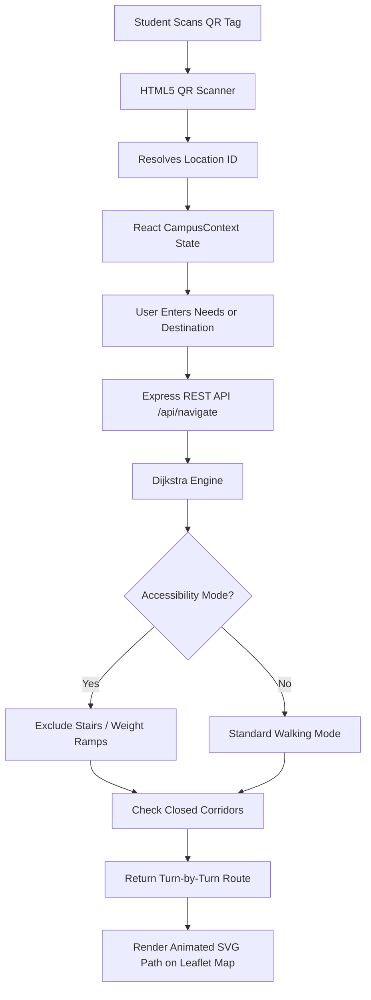

# Campus Pulse Architecture & System Data Flow

## System Data Flow Diagram

```mermaid
graph TD
    A[Student Scans QR Tag] --> B[HTML5 QR Scanner]
    B --> C[Resolves Location ID]
    C --> D[React CampusContext State]
    D --> E[User Enters Needs or Destination]
    E --> F[Express REST API /api/navigate]
    F --> G[Dijkstra Engine]
    G --> H{Accessibility Mode?}
    H -- Yes --> I[Exclude Stairs / Weight Ramps]
    H -- No --> J[Standard Walking Mode]
    I --> K[Check Closed Corridors]
    J --> K
    K --> L[Return Turn-by-Turn Route]
    L --> M[Render Animated SVG Path on Leaflet Map]
```
